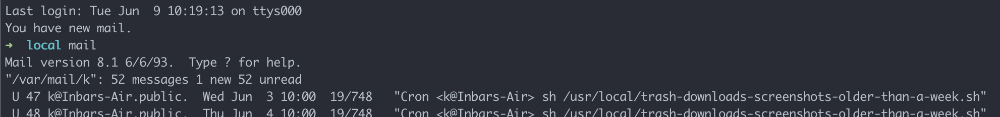
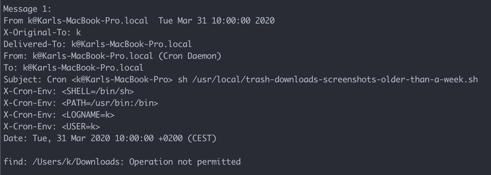

# Cron Jobs

## Setup

For cron job requiring access to `~/Downloads`, `~/Desktop`, or other locations required by macOS security to get access to, add `cron` to the **Full Disk Access** list under **System Preferences** -> **Privacy**:

` on the command line  3. Open the System Preferences -> Privacy -> Full Disk Access pane and click the lock at the bottom left  4. Drag the `cron` program into the list">

If you don't set this up, you will receive an email that tells you "Operation not permitted" for this directory:

