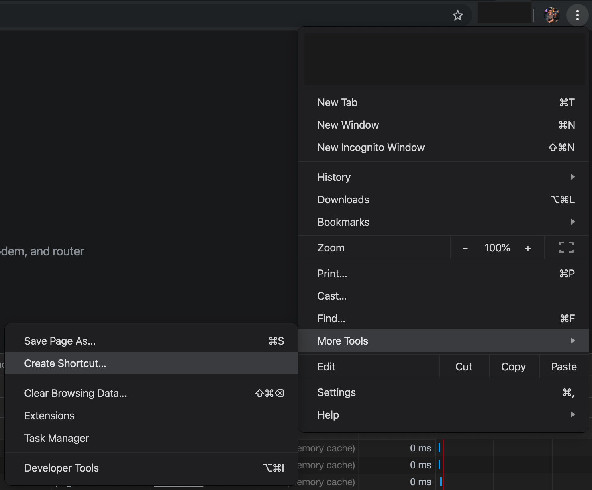
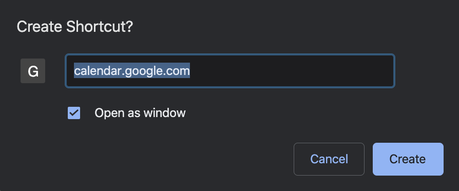
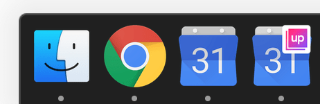

# Create Chrome Desktop App Shortcuts to multiple Google Calendar accounts

## Problem

You have a personal Google Calendar and also a GSuite Google Calendar account, and you want to have [Chrome desktop apps](#chrome-desktop-apps) for both of them.

However, when creating the app to the second account, Chrome does not create a new shortcut - it replaces the existing one.

There are two problems:

1. Creating an app using the `/b/1` url (example URL: https://calendar.google.com/calendar/b/1/r) will default to your main Google Calendar account (when you relaunch it).
2. Creating a new app will replace your existing app.

## Solution

Open the Chrome Devtools and run the following JavaScript in the "Console" panel (change the URL to whatever URL you are trying to create an app for):

```js
const startUrl = 'https://calendar.google.com/calendar/b/1/r';
document.head
  .querySelector(':first-child')
  .insertAdjacentHTML(
    'beforebegin',
    `<link rel="manifest" href='data:application/manifest+json,{"start_url":"${startUrl}"}' />`,
  );
```

This will add a [Web App Manifest](https://www.w3.org/TR/appmanifest) for this website, which will be used when creating the app.

Once you have done this, you can create the desktop app as normal:

1. three dots menu -> More Tools -> Create Shortcut
   <br /><br />
2. Check "Open as window" and select "Create"
   <br /><br />

Now you should have a separate desktop app for your second calendar account!



### Old Solution

This new solution is simpler and works more reliably than [the old solution](https://github.com/karlhorky/dotfiles/blob/3dc4f34f4ef00159987d4dee0dec4aafd8331895/tricks/gsuite-google-calendar-chrome-desktop-app-shortcut.md), which used offline mode in the Network tab.

## Chrome Desktop Apps

Chrome desktop apps can be created for any website or web application, and behave similar to full desktop applications on your computer (see https://twitter.com/karlhorky/status/1127884049073233920).

They are created using the three dots menu -> More Tools -> Create Shortcut -> Check "Open as window" example.
