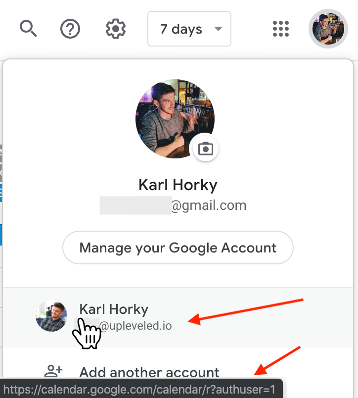
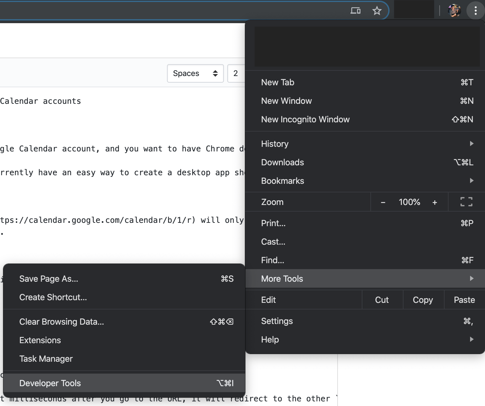
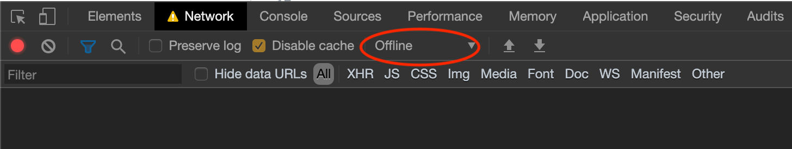
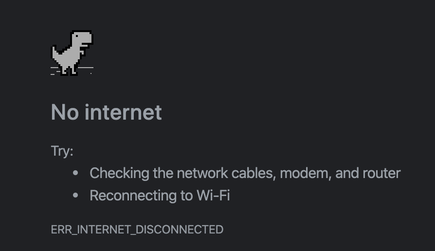

# Create Chrome Desktop App Shortcuts to multiple Google Calendar accounts

## Problem

You have a personal Google Calendar and also a GSuite Google Calendar account, and you want to have Chrome desktop shortcuts to both of them (example: https://twitter.com/karlhorky/status/1127884049073233920).

But Chrome does not want to cooperate. Chrome does not currently have an easy way to create a desktop app shortcut to both the GSuite and normal Google Calendar accounts.

There are two problems:

1. Creating a shortcut to the `/b/1` url (example URL: https://calendar.google.com/calendar/b/1/r) will only go to your GSuite account the first time you create it. The next time you launch it, it will default to your main Google Calendar account.
2. Creating a new shortcut will replace your old shortcut.

## Solution

Create a shortcut with the URL that redirects to your GSuite Google Calendar account:

```
https://calendar.google.com/calendar?authuser=1
```

I found this URL in the account switcher in the top right in Google Calendar:



The problem with creating a shortcut with this URL is that milliseconds after you go to the URL, it will redirect to the other `/b/1` (or similar) URL (example URL: https://calendar.google.com/calendar/b/1/r).

The way to get around this is to use the Chrome Devtools to set your connection to "Offline", so that you have time to create the shortcut before the redirect.

Here are the steps how to do that:

1. Open a new tab
2. Open the Chrome Devtools (under the three dots menu -> `More Tools` -> `Developer Tools`)<br /><br />
   <br /><br />
3. Go to the `Network` tab and set the Throttling dropdown to "Offline". Keep the Devtools open.<br /><br />
   <br /><br />
4. Go to the URL `https://calendar.google.com/calendar?authuser=1`. It will show a page that you have "No internet" (because we turned on the throttling).<br /><br />
   <br /><br />
5. Create a Desktop App Shortcut (under the three dots menu -> `More Tools` -> `Create Shortcut...`). Note: No window should appear at this step!<br /><br />
   <br /><br />
6. Change the Throttling dropdown in the Devtools to "Online" again.
7. Try going to the URL again. While the page loads, there should be a window that pops up, asking if you want to create a shortcut. Check the "Open as window" checkbox and hit "Create".<br /><br />
   <br /><br />
8. You should now have a Chrome Desktop App Shortcut that will launch separately from your regular Google Calendar!
